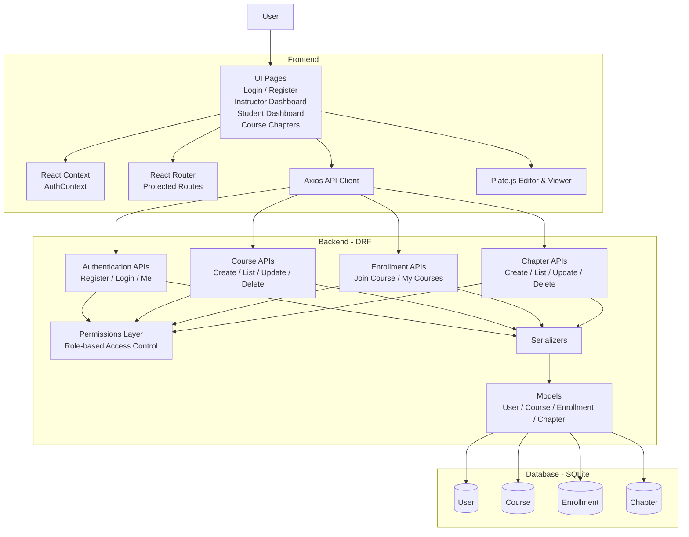

# Learning Management System

A simple Learning Management System built with Django REST Framework and React.
It supports two user roles: Instructor and Student. Instructors can create courses, manage chapters, write chapter content using a Plate.js rich text editor, and control chapter visibility. Students can browse published courses, join courses, and read public chapters.

## Tech Stack

### Backend

* Python
* Django
* Django REST Framework
* Simple JWT
* SQLite for local development
* django-cors-headers

### Frontend

* React
* TypeScript
* Vite
* React Router
* Axios
* Plate.js

## System Architecture

The LMS follows a client-server architecture. The React frontend communicates with the Django REST Framework backend through REST APIs. Authentication, authorization, course management, enrollment, and chapter management are handled by the backend, while SQLite stores application data. Plate.js is used for rich text authoring and rendering of chapter content.



## Features

### Instructor

* Register and login as an instructor
* Create, edit, publish, unpublish, and delete courses
* Create chapters inside owned courses
* Edit chapter title, order, content, and visibility
* Use Plate.js rich text editor for chapter content
* Add headings, bold, italic, underline, inline code, code blocks, blockquotes, links, and image URLs
* Mark chapters as public or private

### Student

* Register and login as a student
* View published courses
* Join a course
* View joined courses
* Read only public chapters from joined courses
* Cannot access private chapters directly through the API

## Project Structure

```txt
lms-assignment/
  backend/
    accounts/
      models.py
      serializers.py
      views.py
      urls.py
      permissions.py
    courses/
      models.py
      serializers.py
      views.py
      urls.py
      permissions.py
    config/
      settings.py
      urls.py
    manage.py
    requirements.txt
    .env.example

  frontend/
    src/
      api/
      components/
      context/
      pages/
      routes/
      types/
      utils/
    package.json
    .env.example

  docs/
    screenshots/

  README.md
```

## Backend Setup

Go to the backend folder:

```bash
cd backend
```

Create and activate a virtual environment:

```bash
python -m venv venv
source venv/bin/activate
```

For Windows PowerShell:

```powershell
venv\Scripts\Activate.ps1
```

Install dependencies:

```bash
pip install -r requirements.txt
```


Run migrations:

```bash
python manage.py migrate
```

Create a superuser:

```bash
python manage.py createsuperuser
```

Start the backend server:

```bash
python manage.py runserver
```

Backend will run at:

```txt
http://127.0.0.1:8000
```

## Frontend Setup

Go to the frontend folder:

```bash
cd frontend
```

Install dependencies:

```bash
npm install
```

Start the frontend server:

```bash
npm run dev
```

Frontend will run at:

```txt
http://localhost:5173
```

## Main API Endpoints

### Authentication

```txt
POST /api/accounts/register/
POST /api/accounts/login/
POST /api/accounts/token/refresh/
GET  /api/accounts/me/
```

### Courses

```txt
GET    /api/courses/
POST   /api/courses/
GET    /api/courses/:id/
PATCH  /api/courses/:id/
DELETE /api/courses/:id/
```

### Enrollment

```txt
POST /api/courses/:id/join/
GET  /api/courses/my-courses/
```

### Chapters

```txt
GET    /api/courses/:course_id/chapters/
POST   /api/courses/:course_id/chapters/
GET    /api/courses/:course_id/chapters/:id/
PATCH  /api/courses/:course_id/chapters/:id/
DELETE /api/courses/:course_id/chapters/:id/
```

## Role-Based Access

### Instructor

Instructors can create and manage only their own courses and chapters.

### Student

Students can view published courses, join courses, and read public chapters from joined courses.

Private chapters are protected on the backend. Even if a student directly calls the API for a private chapter, the backend does not return that chapter.

## Rich Text Editing

Chapter content is created using Plate.js. The editor stores content as structured JSON and saves it in Django's `JSONField`.

This allows rich content such as:

* Headings
* Bold text
* Italic text
* Underline
* Inline code
* Code blocks
* Blockquotes
* Links
* Image URLs

## Security Notes

* JWT authentication is used for protected API routes.
* The backend uses role-based permissions.
* The frontend hides unauthorized actions, but the backend remains the source of truth.
* Instructor and student IDs are not trusted from the frontend for protected operations.
* Course ownership and chapter visibility are checked on the backend.

 